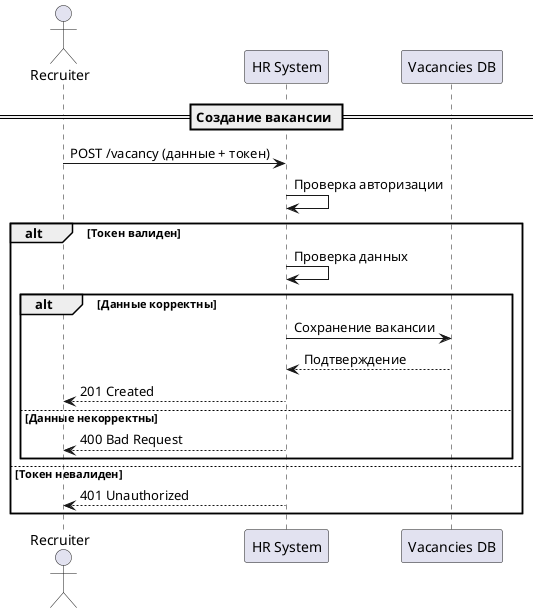

# Сценарий создания вакансии

## Описание алгоритма

1. **Recruiter** отправляет запрос: `POST /vacancy` с данными вакансии и токеном авторизации.
2. **System** проверяет авторизацию:
   * Если токен валиден:
     * **System** проверяет корректность данных:
       * Если корректны:
         * **System** сохраняет вакансию в **Vacancies DB**.
         * **System** отправляет **Recruiter**: `201 Created`.
       * Если некорректны:
         * **System** отправляет **Recruiter**: `400 Bad Request`.
   * Если токен невалиден:
     * **System** отправляет **Recruiter**: `401 Unauthorized`.
