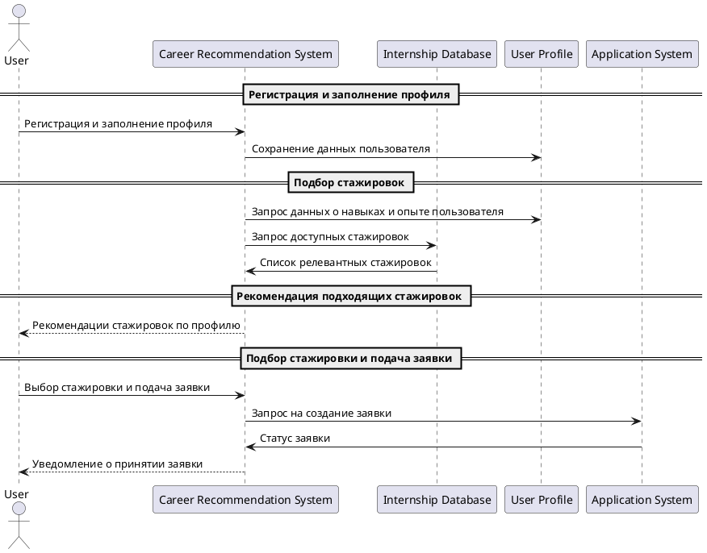

---

title: Подбор и запись на стажировку

sidebar_position: 1

---

# Подбор и запись на стажировку

#### Описание сценария

---

### Описание сценария

1. **User** регистрируется в системе и заполняет свой профиль, указывая информацию о навыках, интересах и опыте.
2. **System** сохраняет данные в **User Profile**.
3. **System** запрашивает информацию о навыках и опыте пользователя из **User Profile** для поиска подходящих стажировок.
4. **System** отправляет запрос в **Internships Database** для получения списка доступных стажировок, которые соответствуют профилю пользователя.
5. **Internships Database** возвращает список стажировок, подходящих пользователю.
6. **System** выводит **User** список подходящих стажировок.
7. **User** выбирает одну из предложенных стажировок и подает заявку через интерфейс системы.
8. **System** передает заявку в **Application System** для создания заявки.
9. **Application System** подтверждает создание заявки.
10. **System** отправляет **User** уведомление о принятии заявки и успешной подаче.

---

### Параметры

| Параметр                      | Описание                                                   |
| ----------------------------- | ---------------------------------------------------------- |
| **User**                       | Пользователь, который заполняет профиль и подает заявку на стажировку. |
| **System**                     | Система, которая анализирует профиль пользователя и подбирает стажировки. |
| **User Profile**               | Профиль пользователя, содержащий его навыки, опыт и интересы. |
| **Internships Database**       | База данных доступных стажировок для пользователей.         |
| **Application System**         | Система для обработки и подачи заявок на стажировки.       |

---

### Структура

- *User Profile* — база данных, содержащая информацию о навыках и опыте пользователя.
- *Internships Database* — база данных стажировок, доступных для пользователей с разными навыками и интересами.
- *Application System* — система, которая обрабатывает заявки пользователей и отслеживает их статус.

---

### Пример вывода

*Персонализированная рекомендация для пользователя*:

- **Рекомендованные стажировки**:
  - Стажировка в области маркетинга в компании XYZ.
  - Стажировка в области аналитики данных в компании ABC.
  
*Процесс подачи заявки:*

1. **Выбор стажировки**: Пользователь выбирает стажировку по маркетингу.
2. **Подача заявки**: Пользователь подает заявку через систему.
3. **Статус заявки**: Заявка принята и отправлена на рассмотрение.

---

### Ссылка

[Посмотреть доступные стажировки](https://career-recommendations.com/internships)

---

---